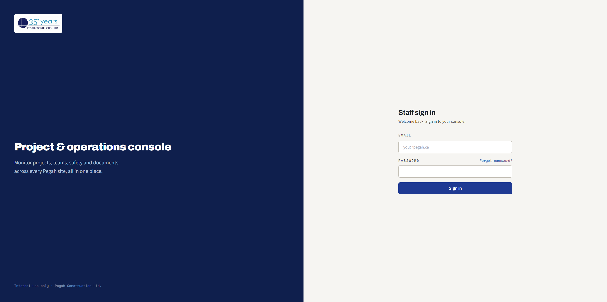
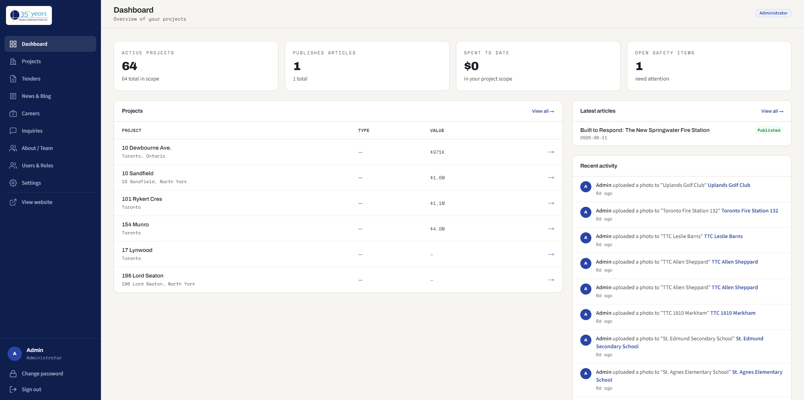
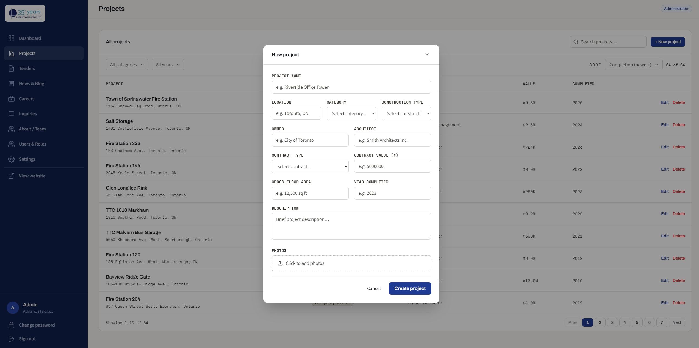
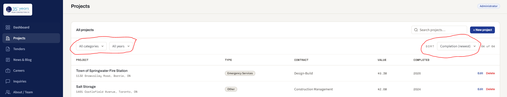
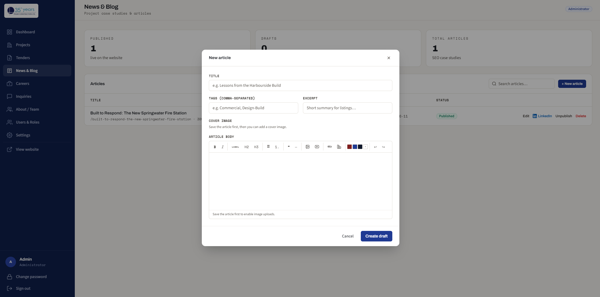
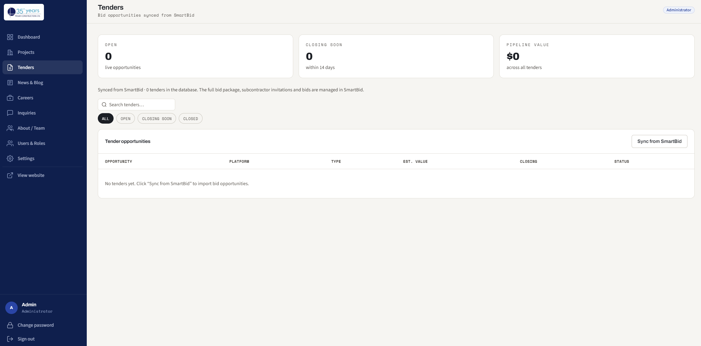
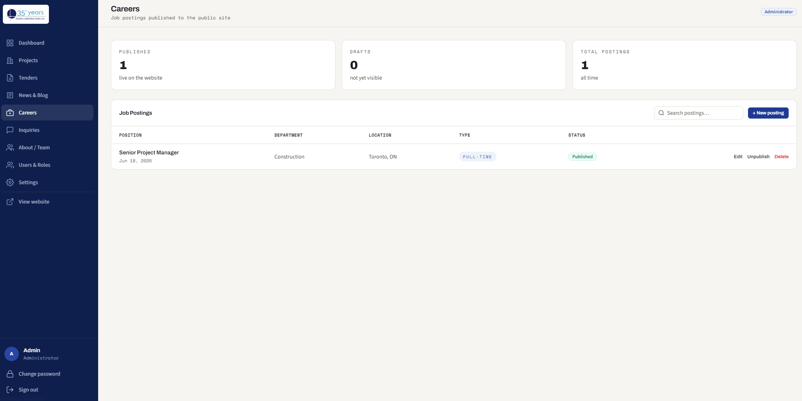
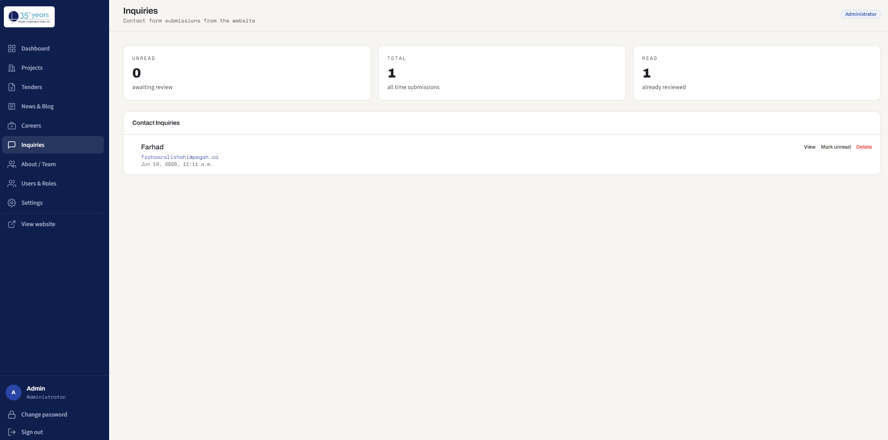
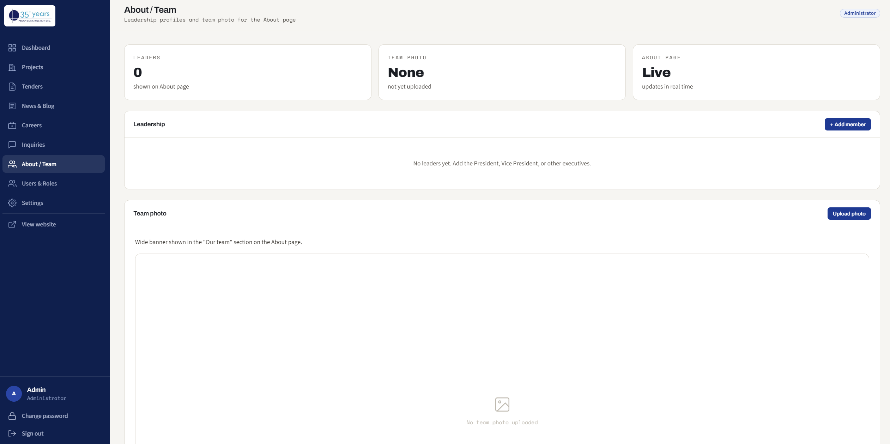
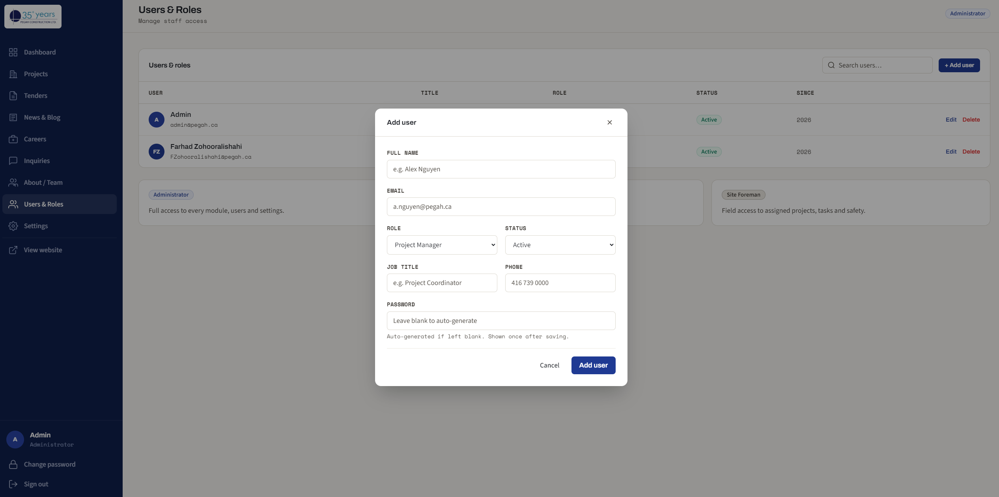

# pegah construction — website admin guide

a practical walkthrough of the pegah construction website and its admin dashboard.
use this to learn the system yourself and to show others how to keep the site up to date.

> 📸 **adding screenshots:** wherever you see a `> 📸 _add screenshot: …_` line, drop
> an image in `docs/images/` and replace the line with ``.
> keep this file in the repo so everyone edits the same copy.

---

## 1. the two halves of the system

| | what it is | who sees it |
|---|---|---|
| **public website** | the marketing site visitors browse (home, about, services, projects, tenders, health & safety, careers, blog, contact). | everyone |
| **admin dashboard** | the private control panel where staff edit content. | logged-in staff only |

most day-to-day content (projects, blog posts, job postings, team members) is edited in the
**admin dashboard**. a handful of fixed marketing pages (about, services, health & safety, the
home page) are part of the site's code and are changed by a developer — see [§13](#13-what-lives-in-code).

---

## 2. signing in

1. go to **`/admin`** (e.g. `https://pegah.ca/admin`).
2. enter your email and password.

**forgot your password?** click **forgot password** on the login screen, enter your email, and a
reset link is emailed to you.

**changing your password** while logged in: open the account menu in the sidebar and choose
**change password**.

---

## 3. roles & what each can do

every user has one role. roles decide which buttons and modules are visible.

| role | can do |
|---|---|
| **administrator** | everything — all content, plus **users & roles** and **settings**. |
| **project manager** | projects, news & blog, tenders, inquiries, about/team. cannot manage users, careers, or settings. |
| **site foreman** | view access only — no editing. |

if a button described in this guide is missing for you, your role probably doesn't have permission
for it. an administrator can adjust roles under **users & roles**.

---

## 4. dashboard home

the landing page after login. it shows a quick overview of projects and recent activity. use the
**left sidebar** to move between modules: dashboard, projects, tenders, news & blog, careers,
inquiries, about / team, users & roles, settings.

---

## 5. projects

**where:** sidebar → **projects**. this is the portfolio shown on the public **projects** page.

### add a project
1. click **+ new project**.
2. fill in the fields: name, location, category (commercial / residential), purpose type,
   construction type, owner, architect, contract type, value, gross floor area, year completed,
   and a description.
3. add photos (you can select several at once).
4. click **create project**.

### edit a project
click **edit** on any row. you can change any field, and **add or remove photos** — photo changes
save immediately (the ✕ on a photo deletes it).

### find and organise projects
above the table you have:
- **search** — matches name, location, type, or contract.
- **category** and **year** filters.
- **sort by** — completion date (newest/oldest), value (high/low), or name.
- **pagination** — 10 projects per page, with prev / next at the bottom.

### generate a blog post from a project
on a project's detail page, **generate blog post** drafts an article from the project's details
(and attached documents) using ai. it's saved as a **draft** in news & blog for you to review and
publish. *(requires the ai key to be configured — see [§14](#14-ai-features).)*

### delete a project
click **delete** on a row and confirm. this also removes its photos and related data.

---

## 6. news & blog

**where:** sidebar → **news & blog**. these are the articles on the public **blog**.

### write or edit an article
1. click **+ new article** (or **edit** an existing one).
2. set the **title**, **cover image**, **tags**, and write the body in the **rich text editor**
   (headings, bold, lists, links, section labels, images, dividers).
3. set the **status**: **draft** (hidden from the public) or **published** (live).
4. optionally mark it **featured** to highlight it on the blog.
5. save.

### generate a linkedin post
inside the article editor, use **generate linkedin post** to create a linkedin-ready caption based
on that article's content. you can edit it and copy it to paste into linkedin. *(requires the ai
key — see [§14](#14-ai-features).)*

---

## 7. tenders

**where:** sidebar → **tenders**. this lists bid opportunities shown on the public **tenders** page.

tenders are **synced from smartbid** — smartbid is the source of truth, so this screen is
**read-only**. you do not create or edit tenders here.

- click **sync from smartbid** to pull the latest opportunities. the screen reports how many were
  added / updated.
- use the **search** and **status** filter to find a tender.
- a tender's **title links out to its smartbid bid room**, where invitations and bids are managed.

---

## 8. careers

**where:** sidebar → **careers** *(administrators only)*. manage the job openings listed on the
public **careers** page — add, edit, or close postings.

---

## 9. inquiries

**where:** sidebar → **inquiries**. messages submitted through the public **contact** form land
here. you can read each message and mark it **read / unread** to track what still needs a reply.

---

## 10. about / team

**where:** sidebar → **about / team**. manage the **leadership** and **team members** shown on the
public **about** page — names, titles, bios, and photos.

---

## 11. users & roles

**where:** sidebar → **users & roles** *(administrators only)*.

- **add a user:** enter their name, email, title, and role. a temporary password is generated and
  shown **once** — copy it and share it with them; they can change it after logging in.
- **edit or deactivate** existing users.
- roles are explained in [§3](#3-roles--what-each-can-do).

---

## 12. settings

**where:** sidebar → **settings** *(administrators only)*. company-level details (company name,
main phone, email, address).

---

## 13. what lives in code

some fixed marketing content isn't edited in the dashboard — it's part of the website's code and is
updated by a developer:

- the **home**, **about**, **services**, and **health & safety** page copy.
- the **navigation menu**, **footer**, company contact details and partner logos.
- site-wide wording and styling.

if you need one of these changed, note exactly what should change (and provide any new images) and
pass it to whoever maintains the code.

---

## 14. ai features

two buttons use ai: **generate blog post** (projects) and **generate linkedin post** (news & blog).
they only work when an **ai key** is configured in the site's environment. if it isn't set, the
buttons show a "not configured" message instead of failing. ask your developer to set the
`anthropic_api_key` to enable them.

---

## 15. quick reference — "how do i…?"

| i want to… | go to |
|---|---|
| add a completed project to the portfolio | **projects → + new project** |
| swap a project's photos | **projects → edit → photos** |
| publish a blog post | **news & blog → new/edit → set status to published** |
| turn a project into a blog draft | **projects → open project → generate blog post** |
| get a linkedin caption for a post | **news & blog → edit → generate linkedin post** |
| refresh the tenders list | **tenders → sync from smartbid** |
| reply-track a contact message | **inquiries → mark read/unread** |
| post a job opening | **careers → add posting** |
| update a leader's bio/photo | **about / team** |
| add a staff login | **users & roles → add user** |
| change my own password | **sidebar account menu → change password** |

---

*keep this guide in the repository so the whole team edits one shared copy. replace the 📸
placeholders with real screenshots as you go.*
