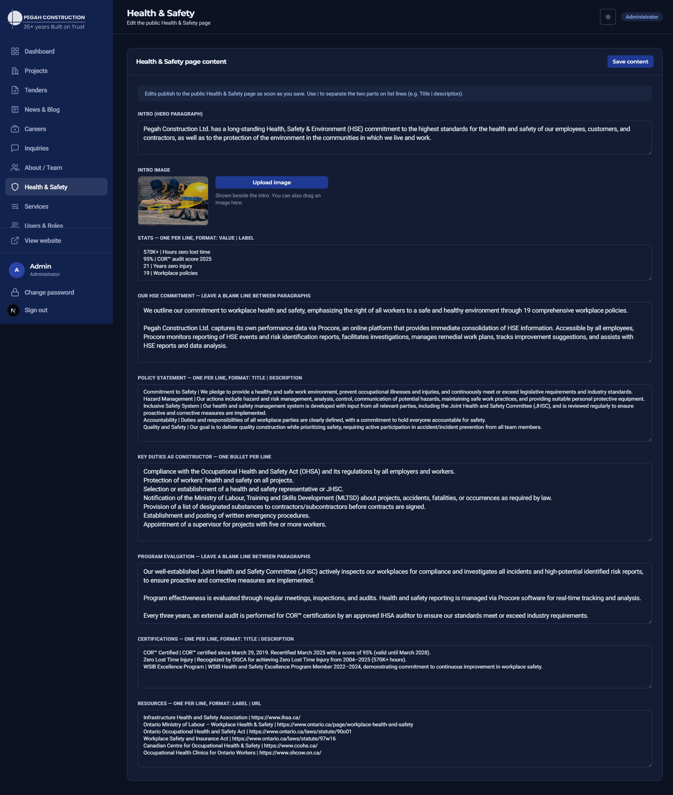
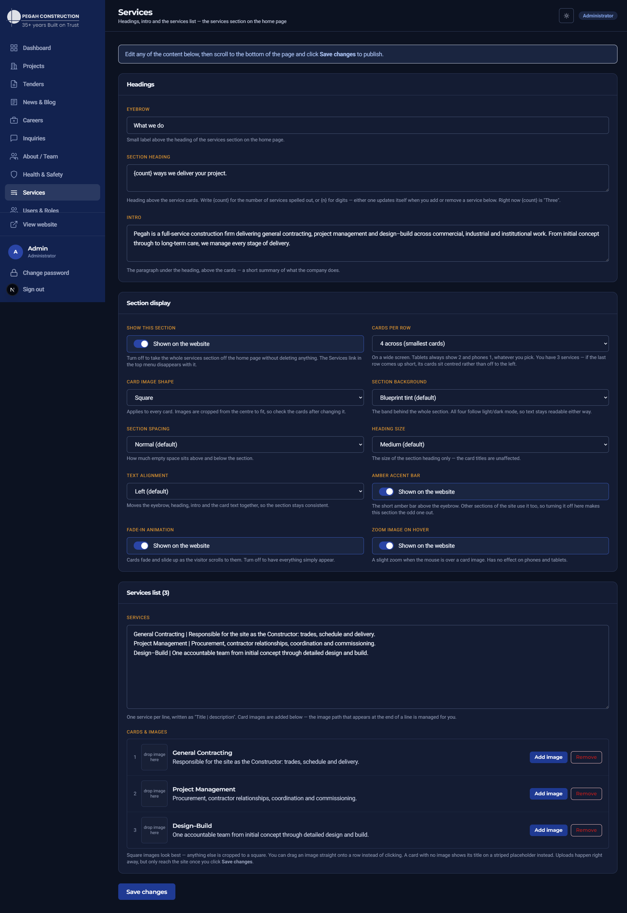
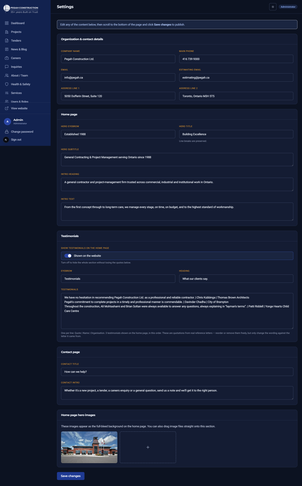

# pegah construction — website admin guide

a practical walkthrough of the pegah construction website and its admin dashboard.
use this to learn the system yourself and to show others how to keep the site up to date.

> 📸 **adding screenshots:** wherever you see a `> 📸 _add screenshot: …_` line, drop
> an image in `docs/images/` and replace the line with ``.
> keep this file in the repo so everyone edits the same copy.

---

## 1. the two halves of the system

| | what it is | who sees it |
|---|---|---|
| **public website** | the marketing site visitors browse (home, about, projects, tenders, health & safety, careers, blog, contact). | everyone |
| **admin dashboard** | the private control panel where staff edit content. | logged-in staff only |

most day-to-day content (projects, blog posts, job postings, team members) is edited in the
**admin dashboard**. the site-wide marketing copy — the **home** page (hero, intro, the **services**
section and the client **testimonials**), plus the **about**, **health & safety** and **contact**
pages and the **navbar** and **footer** details — is now editable too, through the **about / team**,
**health & safety**, **services**, and **settings** screens. only the page layouts, styling and
navigation structure remain in code — see [§18](#18-what-lives-in-code).

---

## 2. signing in

1. go to **`/admin`** (e.g. `https://pegah.ca/admin`), or click **sign in** in the top right of the
   public site — on a phone it's at the bottom of the ☰ menu.
2. enter your email and password.

once you're signed in that button becomes your **initials** (on a phone, a **dashboard** link), which
takes you back to the dashboard from wherever you are on the public site.


**forgot your password?** click **forgot password** on the login screen, enter your email, and a
reset link is emailed to you.

**changing your password** while logged in: open the account menu in the sidebar and choose
**change password**.

---

## 3. roles & what each can do

there is **one role: administrator**. everyone who can sign in has full access to every module,
including **users & roles** and **settings**.

| role | can do |
|---|---|
| **administrator** | everything. it is the only role. |

this is deliberate — the dashboard isn't something the wider company is meant to browse, so there
are no reduced-access accounts to hand out. two things follow from it:

- **only create an account for someone who should see everything.** there is no way to give
  somebody a limited view.
- **a person's job is recorded in their _job title_**, not their role. "site foreman" or "project
  manager" can be someone's title while their access is still administrator.

accounts are added and removed under **users & roles**.

---

## 4. dashboard home

the landing page after login. it shows a quick overview: your **six most recent projects**, the
**four most recent articles**, and a **recent activity** feed of the **last three** things anyone did
(creating a project, uploading photos, publishing an article). the feed is a summary, not a full
audit log — open the module itself to see everything.

across the top are four counts: **active projects**, **published articles**, **spent to date**, and
**unread inquiries** — contact-form messages nobody has opened yet, which is the one number here
that somebody outside the company is waiting on. opening a message in **inquiries** clears it from
that count.

use the **left sidebar** to move between modules: dashboard, projects, tenders, news & blog, careers,
inquiries, about / team, health & safety, services, users & roles, settings.


---

## 5. projects

**where:** sidebar → **projects**. this is the portfolio shown on the public **projects** page.

projects are grouped into two **categories**: **ICI** and **Residential**. **ICI** stands for
**Institutional, Commercial & Industrial** — it covers every non-residential project. ICI projects
can also carry a **purpose type** (education, emergency services, retail, recreation,
transportation, other), which is what shows on the little badge on each project card.

### add a project
1. click **+ new project**.
2. fill in the fields: name, location, **category (ICI / residential)**, **purpose type** (shown for
   ICI projects), construction type, owner, architect, contract type, value, gross floor area, year
   completed, and a description.
3. add photos (you can select several at once).
4. click **create project**.


### edit a project
click **edit** on any row. you can change any field, and **add or remove photos** — photo changes
save immediately (the ✕ on a photo deletes it).

### a project needs a photo to appear publicly

**the public projects page only lists projects that have at least one photo.** the portfolio is a
visual page, and a card with no picture on it is an empty grey box, so those are held back.

everything else about the project is unaffected: it stays in this dashboard, it keeps its own page
at its own address, and **the moment you add a photo it appears on the projects page** — nothing
else to switch on. if you're wondering why a project you can see here isn't on the site, this is
almost always the reason, and adding one photo fixes it.

it's worth knowing how many that currently affects: **64 of the 114 projects have no photos**, so
the public page shows 50. most of the schools, libraries, fire halls and community centres are in
the held-back group. adding photos to them is the single biggest improvement available to the
portfolio.

### find and organise projects
above the table you have:
- **search** — matches name, location, type, or contract.
- **category** filter (ICI / residential); when **ICI** is selected, a second **type** filter
  appears for the purpose types.
- **sort** — newest or oldest by completion date, value (low → high), or name (A–Z).
- **clear filters** — a plain text link that resets the search, filters, and sort.
- **pagination** — 10 projects per page, with prev / next at the bottom.


### generate a blog post from a project
on a project's detail page, **generate blog post** drafts an article from the project's details
(and attached documents) using ai. it's saved as a **draft** in news & blog for you to review and
publish. *(requires the ai key to be configured — see [§19](#19-ai-features).)*

### delete a project
click **delete** on a row and confirm. this also removes its photos and related data.

---

## 6. news & blog

**where:** sidebar → **news & blog**. these are the articles on the public **blog**.

### write or edit an article
1. click **+ new article** (or **edit** an existing one).
2. set the **title**, **cover image**, **tags**, an **excerpt**, and write the body in the **rich text
   editor** (headings, bold, lists, links, section labels, images, dividers).
3. set the **status**: **draft** (hidden from the public) or **published** (live).
4. optionally mark it **featured** to highlight it on the blog.
5. save.

the **excerpt** is a short summary. it does more work than it looks like it does: it's the blurb on
the blog listing, the description google shows in search results, and the text in the preview card
when someone shares the link. so is the **cover image** — see [§17](#17-how-the-site-appears-in-google-and-when-shared).

### working in the article editor

- **the formatting buttons stay put.** the row of buttons sits at the top of the editor and stays
  there while you scroll a long article, so bold, headings and the image button are always in reach.
  the writing area scrolls inside its own box rather than stretching the dialog off the screen.
- **images are shown at a sensible size.** a photo straight off a phone is thousands of pixels tall;
  both the editor and the published article show it as a band of image across the column instead of
  a screenful. the top and bottom of a very tall photo are trimmed to fit, so a **landscape photo
  suits the body of an article better than a portrait one**.
- **dividers appear between sections automatically.** start a section with the **label** button (or
  a heading) and a horizontal rule is drawn above it on the published article. you don't insert
  them yourself — the **—** button is for a deliberate extra break.
- **the body is saved with the article**, so a change to the text only goes live when you save. an
  **image upload happens immediately**, though: the file is stored as soon as you pick it, even if
  you then abandon the edit.


### generate social posts
inside the article editor there are two ai helpers that turn the article into ready-to-post
captions:

- **generate linkedin post** — a linkedin-ready caption.
- **generate instagram post** — an instagram-style caption for the same article.

edit the result and copy it to paste into the network. *(both require the ai key — see
[§19](#19-ai-features).)*

### what readers can do with an article

a published article carries three reader features. none of them need an account — anyone who visits
the blog can use them.

| | where it is | what it does |
|---|---|---|
| **like** ♥ | end of the article | a heart with a running count. clicking again takes the like back. |
| **share** | beside the heart | on phones (and safari) it opens the device's own share sheet — whatsapp, email, messages. everywhere else it copies the link and says "link copied". |
| **comments** | below the article | a public thread anyone can post to. |

two things worth knowing about the numbers:

- **likes are counted per browser, not per person.** someone who clears their browser data, or who
  visits on a phone as well as a laptop, can like the same article more than once. read it as a
  rough popularity signal, not an audited figure.
- **like totals only show on the public article.** the dashboard doesn't display them.

shared links always point at the **live site** (`www.pegah.ca/blog/…`), even when shared from a test
or preview copy — so a link posted to linkedin can't accidentally send people somewhere private.

### reader comments

readers post with a **name**, an **email**, and their **comment**.

- the **email is required but never published.** it's collected so you can follow up privately. only
  the name, the comment, and a relative time ("3 days ago") appear on the site.
- **comments go live the moment they're posted.** there is no approval queue holding them back — which
  is convenient, but it means nobody is stopping a bad comment except you. see moderation below,
  where **hide** takes one down in a couple of clicks.
- **a thread can be closed.** an article whose comments have been closed keeps the comments it has
  and stops taking new ones.
- **drafts don't take comments.** only published articles do.
- two quiet anti-spam measures run in the background: a hidden field that only bots fill in, and a
  **30-second wait** between comments from the same browser. a real reader never notices either.
- length limits are **80 characters** for a name and **2,000** for a comment (a countdown appears as
  the reader nears the limit).

### moderating comments

**where:** news & blog → the **comments** button on the article's row. the button shows a small count
when that article has any.

the panel lists every comment on that article, newest first, and gives you three things to do with
them.

- **hide** takes a comment off the public article straight away but keeps it here, greyed out and
  marked **hidden**, with **restore** to put it back. this is the one to reach for first: it stops
  anyone reading the comment within seconds, and nothing is lost if you change your mind or want to
  show a colleague what was posted.
- **delete** removes it for good — you're asked to confirm, and it cannot be undone. keep this for
  comments that shouldn't exist at all.
- **close comments on this article** (bottom right of the panel) stops new comments on that article
  while leaving the ones already posted readable. visitors see "comments are closed on this article"
  in place of the box. **reopen comments** puts it back. this is per-article, so closing a heated
  thread doesn't affect anything else on the blog.

the **comments** button on the article's row shows the count a reader would see, plus **"n hidden"**
and a **closed** flag when either applies — so the list tells you at a glance where moderation has
happened without opening anything.

you cannot edit the wording of someone's comment; that is deliberate, since editing what a reader
said and leaving their name on it is worse than hiding it.

because comments publish instantly, make a habit of glancing at this panel on recently published
articles.


---

## 7. tenders

**where:** sidebar → **tenders**. this lists bid opportunities shown on the public **tenders** page.

tenders are **synced from smartbid** — smartbid is the source of truth, so this screen is
**read-only**. you do not create or edit tenders here.

- click **sync from smartbid** to pull the latest opportunities. the screen reports how many were
  added / updated.
- use the **search** and **status** filter to find a tender.

**what a subcontractor sees on the public tenders page.** every detail smartbid publishes about a
bid is shown on its card: the project type and floor area, the full site address, the closing date,
**every csi trade division on the bid** (long lists open at six with a "+more" link), and the **bid
manager's name, email, phone and fax**. the search box on that page covers the trade divisions too,
so a trade can find work by typing "concrete" or a division number rather than guessing at the
project title.

smartbid publishes **no description, no contract value and no status** for these bids, which is why
those don't appear. the **open / closing soon / closed** label on each card is worked out from the
closing date — inside a fortnight counts as closing soon — and a bid with no deadline set reads "no
due date".

**the cards don't currently link out to the bid room.** smartbid's feed gives us only a project
number, and turning that into a web address needs one setting a developer adds once (see
[§18](#18-what-lives-in-code)). until that's done the titles are plain text.

on the public tenders page, subcontractors register through the embedded **smartbid subcontractor
registration form** — those registrations go straight to smartbid, not to this dashboard.

**why that form doesn't look like the rest of the site.** the registration form on the
**subcontractor registration** page is smartbid's own page, shown inside a window on ours. it
**cannot be rebuilt in our design**: smartbid publishes no interface for another website to submit a
registration into their system, so the only way a registration reaches smartbid is by someone
filling in smartbid's own form. rebuilding it in our styling would mean the submissions never arrive
where the estimating team looks for them. what we *can* control is everything around it — the
headings, the intro copy, the frame around the form, and the "open in a new tab" link for anyone
who'd rather fill it in full-screen. if smartbid ever publishes such an interface, ask your
developer to revisit it.


---

## 8. careers

**where:** sidebar → **careers**. manage the job openings listed on the
public **careers** page — add, edit, or close postings.


---

## 9. inquiries

**where:** sidebar → **inquiries**. messages submitted through the public **contact** form land
here. you can read each message and mark it **read / unread** to track what still needs a reply.


---

## 10. about / team

**where:** sidebar → **about / team**. this screen edits the whole public **about** page.

### about page text & image
edit the story copy shown on the about page — **who we are**, **where we are**, **what we do**, the
**"Pegah will"** checklist, and the **closing** statement — and upload the **about image** that sits
beside the text. after editing, use the screen's **save** to publish.

### leadership & team
manage the **leadership** and **team members** shown lower on the page — names, **titles**, bios,
and photos. titles show in the amber accent colour on the public page.

**the two sections take titles differently.** a **leadership** entry picks from a fixed list —
president, vice president, partner, chief executive officer, chief operating officer, chief financial
officer, director of operations, project director — so the executive titles stay consistent. a **team
member** takes any title you type ("site foreman", "estimator", "project coordinator"). switching
someone between the two sections keeps their title when the list allows it, and otherwise falls back
to president rather than leaving a title the section wouldn't offer.

**each person has their own photo.** add or replace one from that person's row, or in the add / edit
dialog; the ✕ removes it. someone with no photo shows their initials instead, so a missing photo
never looks broken — you can add people first and collect headshots later.

**finding and ordering people**
- the **search team members** box filters by name or title, which helps once the list runs long. it
  filters the **team members** section only — leadership is short enough to read at a glance.
- the **up / down arrows** on each row set the order people appear in on the public page. they are
  hidden while a search is active, because reordering a filtered list would shuffle people against
  rows you can't currently see. clear the search to reorder.


---

## 11. health & safety

**where:** sidebar → **health & safety**. edits the content of the public **health & safety** page.

you can update the **commitment statement** and its **image**, the **policy statements**, the **key
duties**, the **program / certification** details, and the **resource links**. edit the fields and
save to publish.



---

## 12. services

**where:** sidebar → **services**. one screen for everything about services. there is **no separate
services page** — services are the section part-way down the **home** page, and this screen is all of
it. **edit the fields, then click _save changes_** at the bottom to publish.

**headings**
- **eyebrow** — the small label above the heading of the section.
- **section heading** — the heading above the service cards. write `{count}` for the number of
  services spelled out ("four"), or `{n}` for digits ("4"); either one updates itself when you add or
  remove a service, so the heading can't end up claiming "four ways" when five are listed. the hint
  under the field shows the current value.
- **intro** — the paragraph between the heading and the cards. a short summary of what the company
  does, before the individual services.

**section display**
everything about how the section looks, not just what it says. nothing here can break the page — each
setting picks from a fixed list of options the site already supports.

- **show this section** — takes the whole services section off the home page without deleting a word
  of it. the **services** link in the top menu disappears at the same time, so the menu never points
  at a section that isn't there. turn it back on and everything returns exactly as it was.
- **cards per row** — 2, 3 or 4 across on a wide screen; this is also what sets how big the cards are,
  since fewer per row means each one is wider. on a typical laptop that is roughly 630px wide at "2
  across" (the default), 400px at "3 across" and 285px at "4 across". tablets always show 2 and phones
  1, whatever you choose. if your number of services doesn't divide evenly the last row comes up short, and those
  leftover cards sit **centred** under the full rows rather than off to the left — so five services
  at "4 across" reads as a row of four with the fifth centred beneath.
- **card image shape** — square, landscape, wide or portrait, applied to every card at once. photos
  are cropped from the middle outwards to fit, so glance at the cards after changing it: a shape that
  suits one photo can cut the top off another.
- **section background** — the band behind the section: the default blueprint tint, plain white,
  off-white, or a light blue tint. all four follow light and dark mode, so the text stays readable.
- **section spacing** — how much empty space sits above and below the section: compact, normal or
  roomy.
- **heading size** — small, medium or large. affects the section heading only; the card titles stay
  as they are.
- **text alignment** — left or centred. moves the eyebrow, heading, intro **and** the card text
  together, so the section can't end up half-centred.
- **amber accent bar** — the short amber bar above the eyebrow. other sections of the site use the
  same bar, so switching it off here makes this section the odd one out.
- **fade-in animation** — cards fade and slide up as a visitor scrolls down to them. off means
  everything is simply there.
- **zoom image on hover** — a slight zoom when the mouse sits over a card image. no effect on phones
  or tablets, which have no hover.

**services list**
one service per line, written as `Title | description`. below the box, **cards & images** shows how
each line was read, numbered as it will appear on the site — if a line is missing its `|`, it flags
it. the card header shows the current count. with an empty list, the section hides itself rather than
showing a heading with no cards.

**removing a service**
each row in **cards & images** has a red **remove** button that deletes the whole card — title,
description and image reference together — after asking you to confirm. it is the same as deleting
that line from the box above, so like every other edit here it only reaches the website when you
click **save changes**; if you remove one by mistake, leave the page without saving and it comes
back. the photo that was uploaded for it stays in storage rather than being deleted, precisely so
that undo works.

**card images**
each card can carry its own photo, set from the **cards & images** list: **add image** (or
**replace**) opens the file picker, and **clear image** removes just the picture and keeps the card. you can also drag an image straight onto a
row instead of clicking. photos are cropped to whatever **card image shape** is set above, from the
middle outwards, so pick photos whose subject sits near the centre. a card with no photo of its own
falls back to the stock photo that ships with the site for that service, and anything unrecognised
shows its number on a striped placeholder instead. those stock photos are stand-ins, not pegah
projects — uploading a real photo of our own work is always better, and it replaces the stock one
straight away.
uploading happens right away, but like every other field the change only reaches the site once you
click **save changes**. the image path the upload adds to the end of the service's line is managed
for you; leave it alone when editing the text.



---

## 13. users & roles

**where:** sidebar → **users & roles**.

- **add a user:** enter their name, email, title, and role. a temporary password is generated and
  shown **once** — copy it and share it with them; they can change it after logging in.
- **edit or deactivate** existing users.
- roles are explained in [§3](#3-roles--what-each-can-do).


---

## 14. settings

**where:** sidebar → **settings**. this is where the site-wide copy lives.
**edit any field, then scroll to the bottom of the page and click _save changes_** to publish.

the settings are grouped:

- **organization & contact details** — company name, main phone, email, estimating email, and
  address lines 1 & 2. these feed the **navbar**, the **footer**, and the **contact** page.
- **home page** — the hero **eyebrow**, **title**, and **subtitle**, plus the **intro heading** and
  **intro text** below the hero.
- **testimonials** — the client quotes near the bottom of the home page. see below.
- **home page hero images** — upload or remove the full-bleed background image(s). if you add more
  than one, they cycle as a carousel. the ✕ on an image removes it.
- **contact page** — the contact **title** and **intro** shown above the form.

**testimonials**

one quote per line, written as **quote | name | organisation**, separated by the upright bar
character. the line

```
Pegah's commitment to complete projects in a timely and professional manner is commendable. | Davinder Chadha | City of Brampton
```

becomes one card. they appear on the home page in the order you list them, and the hint under the
box counts how many lines are being read as a testimonial, so you can check your bars landed in the
right places. a line with no name or organisation still shows its quote.

the **show testimonials on the home page** switch hides the whole section without deleting anything,
which is the safe way to take it down for a while. an empty box hides it too.

these are quotations from real reference letters. reorder them, retire one, add a new one — but only
change the wording of a quote against the letter it came from, or we are putting words in a client's
mouth.

services copy is **not** here — it has its own screen, **sidebar → services**. see
[§12](#12-services).




---

## 15. phones and tablets

the public site and the dashboard both adapt to whatever screen they're on. there is no separate
mobile site to keep in step, and nothing extra to do when you publish.

on a phone, or in a narrow window:

- the navbar's links collapse behind a **☰ menu button**. tapping it opens the full menu, which
  **scrolls on its own** when there are more links than fit the screen, and closes as soon as you
  choose a page.
- the dashboard's sidebar collapses the same way.
- project grids, article layouts and the home page stack into a single column.

**it's still worth a phone check after you publish something substantial.** the layout adapts by
itself, but what you type and upload doesn't: an unusually long project name, a very wide photo, or
a table pasted into an article can still sit awkwardly on a narrow screen.

---

## 16. light and dark mode

the site can be viewed in a light or a dark colour scheme. the **sun / moon button** switches
between them — top right of the public navbar, and in the dashboard's top bar.

- until someone chooses, the site **follows the device's own light/dark setting** — a visitor whose
  phone is in dark mode sees the dark site straight away.
- once chosen, the choice is **remembered in that browser only**. it is not a setting you publish,
  and switching it changes nothing for anyone else.
- every page is designed for both, the dashboard included.
- **photos are shown as-is in both modes.** an image with a white background will sit on a dark page
  as a bright rectangle. that's fine for a photograph, but if it matters for a logo or a diagram,
  supply a version with a transparent background.

---

## 17. how the site appears in google and when shared

this looks after itself, but it runs on the same fields you already edit — so it's worth knowing
which ones do the work. there is **no separate seo screen**, and nothing to submit anywhere.

- **the title and description google shows** come from the editors: an article's **title** and
  **excerpt**, a project's **description**, and so on. writing a clear excerpt *is* the seo work.
- **new pages announce themselves.** the site maintains a sitemap that rebuilds on its own and lists
  every project and every **published** article. publishing is all that's needed for a page to become
  findable. drafts are deliberately left out.
- **the dashboard is kept out of search results.** `/admin` and the site's internal addresses are
  excluded, so staff pages can't surface in a google search.
- **shared links expand into a preview card.** paste a link into linkedin, whatsapp or teams and it
  becomes a card with a title, a description and an image. an article uses its **cover image**;
  anything without one falls back to the site's default image. this is the practical reason to give
  every article a cover image.
- **the business details google reads about pegah** — the company name, address, phone, and that it's
  a general contractor serving ontario — come from the site's code rather than from settings. see
  [§18](#18-what-lives-in-code).

---

## 18. what lives in code

thanks to the editors above, the **home** page copy (including its **services** section), the
**about, health & safety and contact** page copy, and the navbar/footer contact details are all
editable in the dashboard. what still lives in the
website's code and needs a **developer** to change:

- **page layouts and overall styling** — fonts, the navy + amber colour palette, the
  blueprint-grid background texture, spacing and card treatments.
- the **navigation menu structure** and which items appear.
- **partner / affiliation logo images** and where they're displayed.
- the **subcontractor registration form** itself — it belongs to smartbid, not to us. see
  [§7](#7-tenders).
- the **careers email** (`hr@pegah.ca`) that the "apply" and "send your resume" links on the careers
  page open. it is not a settings field — changing it needs a developer.
- the **link from a tender card to its smartbid bid room**. smartbid gives us a project number and
  the address is built from it, which needs a one-off setting (`smartbid_project_url_template`). ask
  your developer for it, with the web address of any one bid as an example, and every tender becomes
  clickable. see [§7](#7-tenders).
- the **business details google reads** (company name, address, phone, area served), which are
  separate from the contact details in **settings**. if you change the phone or address in settings,
  ask your developer to update these to match.
- anything not exposed as a field in **settings** or the **about / team** and **health & safety**
  editors.

if you need one of these changed, note exactly what should change (and provide any new images) and
pass it to whoever maintains the code.

---

## 19. ai features

three buttons use ai:

- **generate blog post** (projects) — drafts an article from a project.
- **generate linkedin post** (news & blog) — a linkedin caption for an article.
- **generate instagram post** (news & blog) — an instagram caption for an article.

they only work when an **ai key** is configured in the site's environment. if it isn't set, the
buttons show a "not configured" message instead of failing. ask your developer to set the
`anthropic_api_key` to enable them.

---

## 20. quick reference — "how do i…?"

| i want to… | go to |
|---|---|
| add a completed project to the portfolio | **projects → + new project** |
| swap a project's photos | **projects → edit → photos** |
| work out why a project isn't on the public site | it has **no photo** — **projects → edit → photos** |
| publish a blog post | **news & blog → new/edit → set status to published** |
| turn a project into a blog draft | **projects → open project → generate blog post** |
| get a linkedin caption for a post | **news & blog → edit → generate linkedin post** |
| get an instagram caption for a post | **news & blog → edit → generate instagram post** |
| read the comments readers left on an article | **news & blog → comments** |
| take a comment off the article but keep it | **news & blog → comments → hide** |
| remove an offensive or spam comment for good | **news & blog → comments → delete** |
| stop new comments on one article | **news & blog → comments → close comments on this article** |
| see how many likes an article has | the **public article page** — not shown in the dashboard |
| fix how an article looks when shared or in google | **news & blog → edit → excerpt + cover image** |
| refresh the tenders list | **tenders → sync from smartbid** |
| reply-track a contact message | **inquiries → mark read/unread** |
| post a job opening | **careers → add posting** |
| edit the about page story text or image | **about / team** |
| update a leader's bio/photo | **about / team** |
| add a photo for one team member | **about / team → that person's row → photo** |
| find someone in a long team list | **about / team → search team members** |
| change the order people appear on the about page | **about / team → up / down arrows** (clear the search first) |
| switch between light and dark mode | the **sun / moon button** in the navbar or dashboard top bar |
| update the health & safety page | **health & safety** |
| change the home page hero wording | **settings → home page** |
| swap the home hero background images | **settings → home page hero images** |
| edit the services list, a services heading, or a service's card image | **services** |
| add or reorder a client quote on the home page | **settings → testimonials** |
| take the testimonials off the home page for a while | **settings → testimonials → show testimonials** |
| add a partner or executive to the about page | **about / team → add member → section: leadership** |
| change the contact page intro | **settings → contact page** |
| change company phone/address (navbar, footer, contact) | **settings → organization & contact details** |
| add a staff login | **users & roles → add user** |
| change my own password | **sidebar account menu → change password** |

---

*keep this guide in the repository so the whole team edits one shared copy. replace the 📸
placeholders with real screenshots as you go.*
