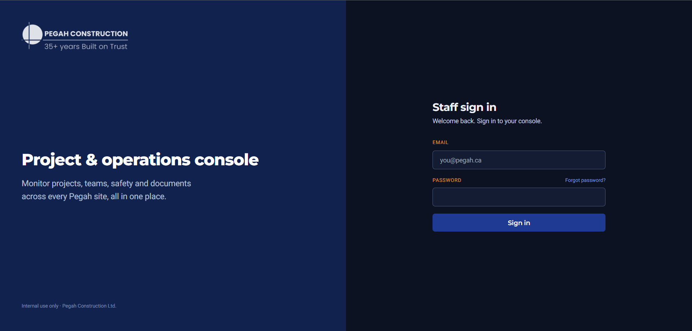
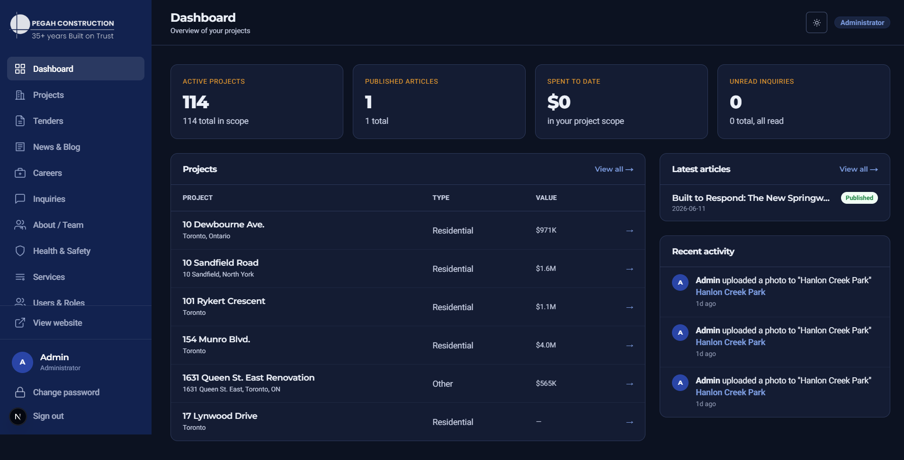
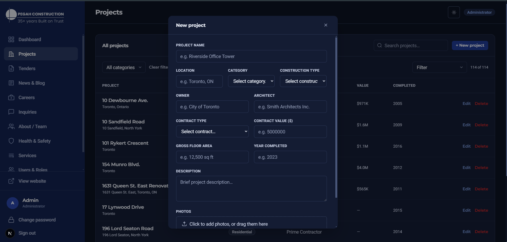
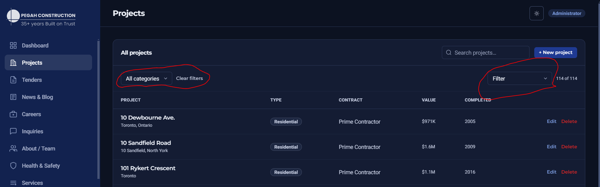
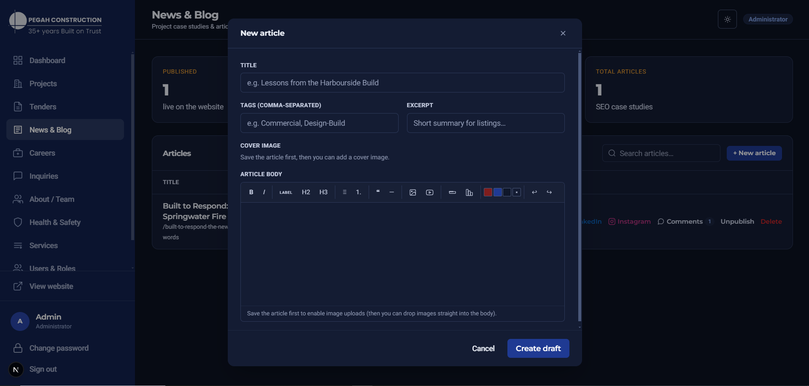
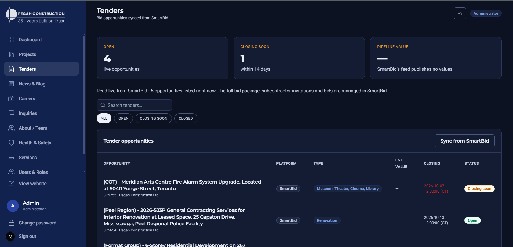
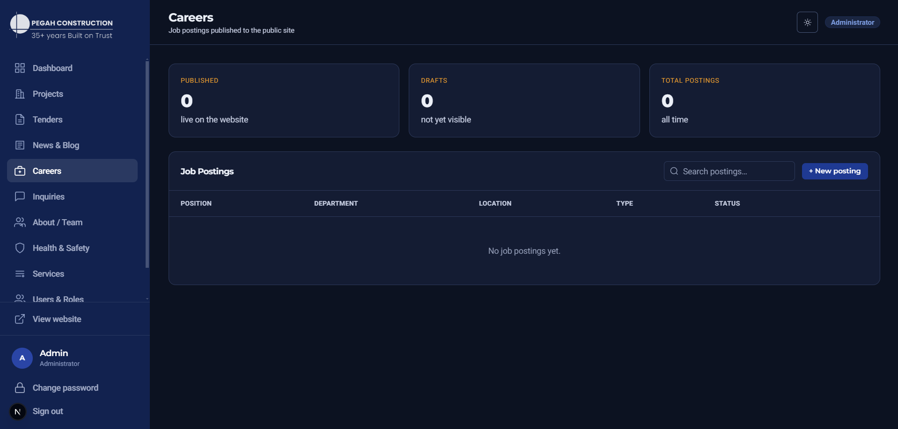
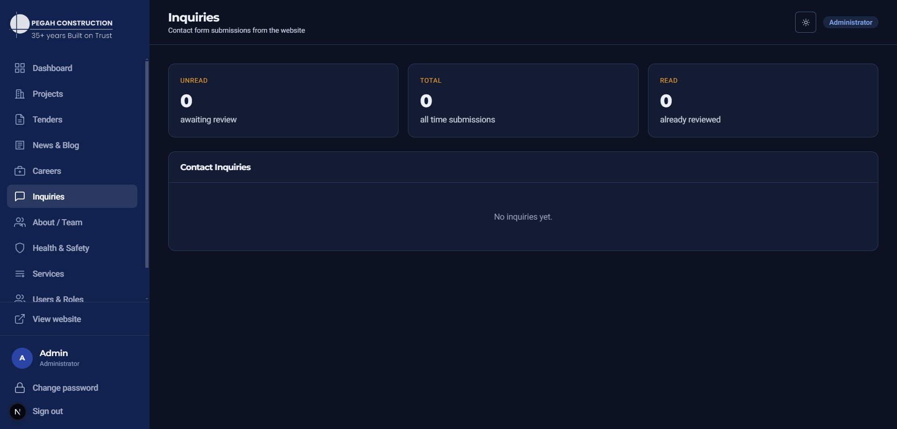
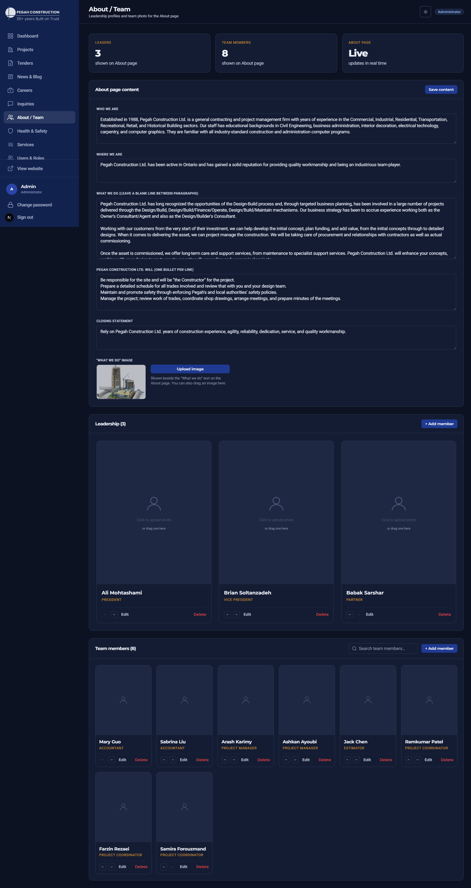
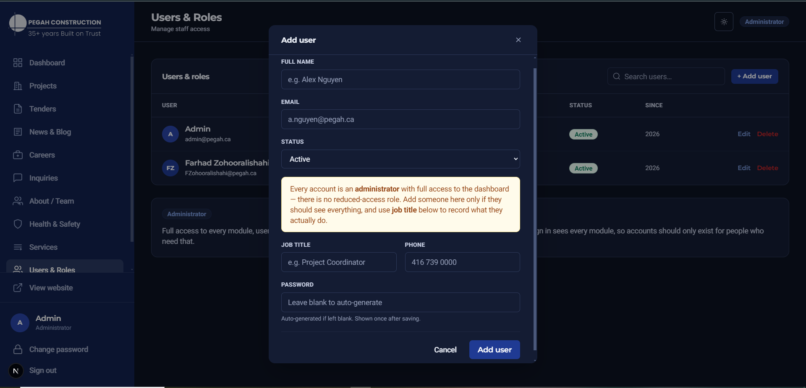

# pegah construction — website admin guide

a practical walkthrough of the pegah construction website and its admin dashboard.
use this to learn the system yourself and to show others how to keep the site up to date.

> 📸 **adding screenshots:** wherever you see a `> 📸 _add screenshot: …_` line, drop
> an image in `docs/images/` and replace the line with ``.
> keep this file in the repo so everyone edits the same copy.

---

## 1. the two halves of the system

| | what it is | who sees it |
|---|---|---|
| **public website** | the marketing site visitors browse (home, about, services, projects, tenders, health & safety, careers, blog, contact). | everyone |
| **admin dashboard** | the private control panel where staff edit content. | logged-in staff only |

most day-to-day content (projects, blog posts, job postings, team members) is edited in the
**admin dashboard**. the site-wide marketing copy — the **home**, **about**, **services**,
**health & safety** and **contact** pages, plus the **navbar** and **footer** details — is now
editable too, through the **about / team**, **health & safety**, **services**, and **settings**
screens. only the
page layouts, styling and navigation structure remain in code — see [§15](#15-what-lives-in-code).

---

## 2. signing in

1. go to **`/admin`** (e.g. `https://pegah.ca/admin`).
2. enter your email and password.

**forgot your password?** click **forgot password** on the login screen, enter your email, and a
reset link is emailed to you.

**changing your password** while logged in: open the account menu in the sidebar and choose
**change password**.

---

## 3. roles & what each can do

every user has one role. roles decide which buttons and modules are visible.

| role | can do |
|---|---|
| **administrator** | everything — all content, plus **users & roles** and **settings**. |
| **project manager** | projects, news & blog, tenders, inquiries, about/team. cannot manage users, careers, or settings. |
| **site foreman** | view access only — no editing. |

if a button described in this guide is missing for you, your role probably doesn't have permission
for it. an administrator can adjust roles under **users & roles**.

---

## 4. dashboard home

the landing page after login. it shows a quick overview of projects and recent activity. use the
**left sidebar** to move between modules: dashboard, projects, tenders, news & blog, careers,
inquiries, about / team, health & safety, services, users & roles, settings.

---

## 5. projects

**where:** sidebar → **projects**. this is the portfolio shown on the public **projects** page.

projects are grouped into two **categories**: **ICI** and **Residential**. **ICI** stands for
**Institutional, Commercial & Industrial** — it covers every non-residential project. ICI projects
can also carry a **purpose type** (education, emergency services, retail, recreation,
transportation, other), which is what shows on the little badge on each project card.

### add a project
1. click **+ new project**.
2. fill in the fields: name, location, **category (ICI / residential)**, **purpose type** (shown for
   ICI projects), construction type, owner, architect, contract type, value, gross floor area, year
   completed, and a description.
3. add photos (you can select several at once).
4. click **create project**.

### edit a project
click **edit** on any row. you can change any field, and **add or remove photos** — photo changes
save immediately (the ✕ on a photo deletes it).

### find and organise projects
above the table you have:
- **search** — matches name, location, type, or contract.
- **category** filter (ICI / residential); when **ICI** is selected, a second **type** filter
  appears for the purpose types.
- **sort** — newest or oldest by completion date, value (low → high), or name (A–Z).
- **clear filters** — a plain text link that resets the search, filters, and sort.
- **pagination** — 10 projects per page, with prev / next at the bottom.

### generate a blog post from a project
on a project's detail page, **generate blog post** drafts an article from the project's details
(and attached documents) using ai. it's saved as a **draft** in news & blog for you to review and
publish. *(requires the ai key to be configured — see [§16](#16-ai-features).)*

### delete a project
click **delete** on a row and confirm. this also removes its photos and related data.

---

## 6. news & blog

**where:** sidebar → **news & blog**. these are the articles on the public **blog**.

### write or edit an article
1. click **+ new article** (or **edit** an existing one).
2. set the **title**, **cover image**, **tags**, and write the body in the **rich text editor**
   (headings, bold, lists, links, section labels, images, dividers).
3. set the **status**: **draft** (hidden from the public) or **published** (live).
4. optionally mark it **featured** to highlight it on the blog.
5. save.

### generate social posts
inside the article editor there are two ai helpers that turn the article into ready-to-post
captions:

- **generate linkedin post** — a linkedin-ready caption.
- **generate instagram post** — an instagram-style caption for the same article.

edit the result and copy it to paste into the network. *(both require the ai key — see
[§16](#16-ai-features).)*

---

## 7. tenders

**where:** sidebar → **tenders**. this lists bid opportunities shown on the public **tenders** page.

tenders are **synced from smartbid** — smartbid is the source of truth, so this screen is
**read-only**. you do not create or edit tenders here.

- click **sync from smartbid** to pull the latest opportunities. the screen reports how many were
  added / updated.
- use the **search** and **status** filter to find a tender.
- a tender's **title links out to its smartbid bid room**, where invitations and bids are managed.

on the public tenders page, subcontractors register through the embedded **smartbid subcontractor
registration form** — those registrations go straight to smartbid, not to this dashboard.

---

## 8. careers

**where:** sidebar → **careers** *(administrators only)*. manage the job openings listed on the
public **careers** page — add, edit, or close postings.

---

## 9. inquiries

**where:** sidebar → **inquiries**. messages submitted through the public **contact** form land
here. you can read each message and mark it **read / unread** to track what still needs a reply.

---

## 10. about / team

**where:** sidebar → **about / team**. this screen edits the whole public **about** page.

### about page text & image
edit the story copy shown on the about page — **who we are**, **where we are**, **what we do**, the
**"Pegah will"** checklist, and the **closing** statement — and upload the **about image** that sits
beside the text. after editing, use the screen's **save** to publish.

### leadership & team
manage the **leadership** (president, vice president) and **team members** shown lower on the page —
names, **titles**, bios, and photos. titles show in the amber accent colour on the public page.

---

## 11. health & safety

**where:** sidebar → **health & safety**. edits the content of the public **health & safety** page.

you can update the **commitment statement** and its **image**, the **policy statements**, the **key
duties**, the **program / certification** details, and the **resource links**. edit the fields and
save to publish.

> 📸 _add screenshot: health & safety editor_

---

## 12. services

**where:** sidebar → **services** *(administrators only)*. one screen for everything about services —
it feeds both the public **services** page and the services section on the **home** page.
**edit the fields, then click _save changes_** at the bottom to publish.

**headings**
- **eyebrow** — the small label above the heading. used on both the services page and the home page
  section.
- **page title** — the services page heading, and the browser tab title.
- **home page section heading** — the heading above the service cards on the home page. write
  `{count}` for the number of services spelled out ("four"), or `{n}` for digits ("4"); either one
  updates itself when you add or remove a service, so the heading can't end up claiming "four ways"
  when five are listed. the hint under the field shows the current value.
- **intro** — shown under the services page title, and used as the page's search-result description.

**services list**
one service per line, written as `Title | description`. the **preview** below the box shows how each
line was read, numbered as it will appear on the site — if a line is missing its `|`, the preview
flags it. the card header shows the current count. with an empty list, the home page section hides
itself rather than showing a heading with no cards.

> 📸 _add screenshot: services editor_

---

## 13. users & roles

**where:** sidebar → **users & roles** *(administrators only)*.

- **add a user:** enter their name, email, title, and role. a temporary password is generated and
  shown **once** — copy it and share it with them; they can change it after logging in.
- **edit or deactivate** existing users.
- roles are explained in [§3](#3-roles--what-each-can-do).

---

## 14. settings

**where:** sidebar → **settings** *(administrators only)*. this is where the site-wide copy lives.
**edit any field, then scroll to the bottom of the page and click _save changes_** to publish.

the settings are grouped:

- **organization & contact details** — company name, main phone, email, estimating email, and
  address lines 1 & 2. these feed the **navbar**, the **footer**, and the **contact** page.
- **home page** — the hero **eyebrow**, **title**, and **subtitle**, plus the **intro heading** and
  **intro text** below the hero.
- **home page hero images** — upload or remove the full-bleed background image(s). if you add more
  than one, they cycle as a carousel. the ✕ on an image removes it.
- **contact page** — the contact **title** and **intro** shown above the form.

services copy is **not** here — it has its own screen, **sidebar → services**. see
[§12](#12-services).

> 📸 _add screenshot: settings page_

---

## 15. what lives in code

thanks to the editors above, the **home, about, services, health & safety and contact** page copy —
and the navbar/footer contact details — are all editable in the dashboard. what still lives in the
website's code and needs a **developer** to change:

- **page layouts and overall styling** — fonts, the navy + amber colour palette, the
  blueprint-grid background texture, spacing and card treatments.
- the **navigation menu structure** and which items appear.
- **partner / affiliation logo images** and where they're displayed.
- anything not exposed as a field in **settings** or the **about / team** and **health & safety**
  editors.

if you need one of these changed, note exactly what should change (and provide any new images) and
pass it to whoever maintains the code.

---

## 16. ai features

three buttons use ai:

- **generate blog post** (projects) — drafts an article from a project.
- **generate linkedin post** (news & blog) — a linkedin caption for an article.
- **generate instagram post** (news & blog) — an instagram caption for an article.

they only work when an **ai key** is configured in the site's environment. if it isn't set, the
buttons show a "not configured" message instead of failing. ask your developer to set the
`anthropic_api_key` to enable them.

---

## 17. quick reference — "how do i…?"

| i want to… | go to |
|---|---|
| add a completed project to the portfolio | **projects → + new project** |
| swap a project's photos | **projects → edit → photos** |
| publish a blog post | **news & blog → new/edit → set status to published** |
| turn a project into a blog draft | **projects → open project → generate blog post** |
| get a linkedin caption for a post | **news & blog → edit → generate linkedin post** |
| get an instagram caption for a post | **news & blog → edit → generate instagram post** |
| refresh the tenders list | **tenders → sync from smartbid** |
| reply-track a contact message | **inquiries → mark read/unread** |
| post a job opening | **careers → add posting** |
| edit the about page story text or image | **about / team** |
| update a leader's bio/photo | **about / team** |
| update the health & safety page | **health & safety** |
| change the home page hero wording | **settings → home page** |
| swap the home hero background images | **settings → home page hero images** |
| edit the services list, or any services heading | **services** |
| change the contact page intro | **settings → contact page** |
| change company phone/address (navbar, footer, contact) | **settings → organization & contact details** |
| add a staff login | **users & roles → add user** |
| change my own password | **sidebar account menu → change password** |

---

*keep this guide in the repository so the whole team edits one shared copy. replace the 📸
placeholders with real screenshots as you go.*
